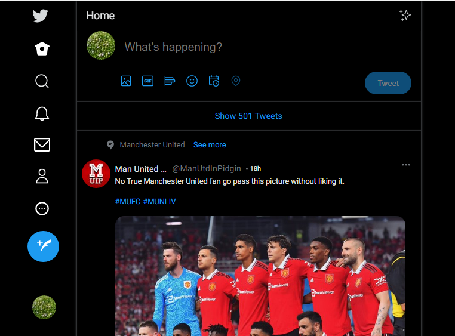
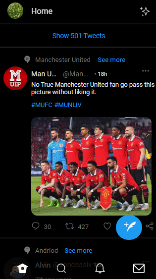

 TWITTER HOMEPAGE DOCUMENTATION
This Twitter Homepage project helped us learn more about Positioning, flexbox and opacity

## PROJECT CONTRIBUTORS
* Myself
* Taiwo Joshua

## LANGUAGES USED
* HTML
* CSS

## PROCESSES USED
* Media Queries
* Flexbox
* Positioning

---

### Normal Desktop Screensot

## Smaller Desktop Screensot

## Tablet Screensot

## Moblie Screensot

## LIVE SITE
[Huddle Page](https://jozz77.github.io/Twitter-Home-Page/)

---
### RESOURCES
* Got all my icons from [CSS Peeper]

### WHAT'S NEW
* Learned more about positioning using the absolute, left, right and top or bottom tags